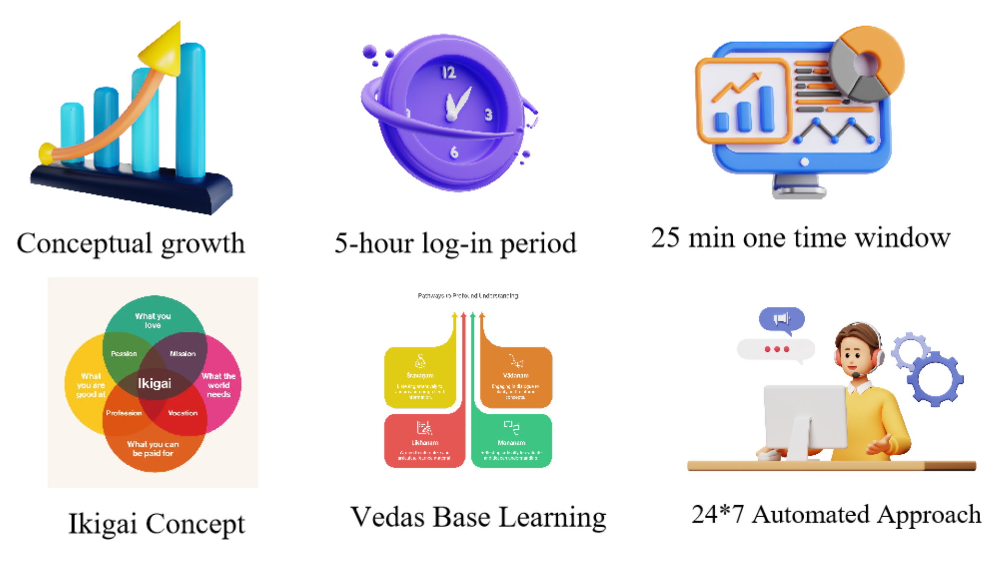

# 🧠 AI Powered Career Coach - Team GCOEY

**AGTechathon 2025 | AG Patil Institute of Technology, Solapur**  
🚀 Empowering Tier II & III College Students to Become Industry-Ready with AI  

---

## 🚨 Problem Statement

>"A degree ≠ a job, but with the right skills and direction, it can be."

Each year, **20+ lakh B.Tech graduates** step into the job market — yet **only 20–30%** are industry-ready.  
Outdated preparation methods, lack of personalized guidance, and limited exposure to real-time skill feedback have made job readiness a major challenge.

---

## 💡 Solution Overview

🎯 **Goal**: Help students discover their best career path and become job-ready with personalized, AI-driven support.

---

### 🔁 Approach

- **Analyze** – Career interest and skill assessment  
- **Recommend** – AI-suggested roles and roadmaps  
- **Prepare** – Skill-based modules, interview prep  
- **Optimize** – Real-time feedback with AI  
- **Engage** – Gamify learning with rewards & badges  

---

## ✨ Key Features

- ✅ Ikigai-Based Role Selection  
- ✅ Real-Time Resume & Feedback Analysis  
- ✅ Mock Interviews & Coding Rounds  
- ✅ Gamification with Badges & Rewards  
- ✅ Department-wise Job Roadmaps  
- ✅ AI-powered Resume Optimization  
- ✅ Soft Skills Tracker & Learning Modules  
- ✅ Multi-language Support  
- ✅ Career Planning, Development, & Interview Simulation  
- ✅ Industry-Specific Learning Paths  

---

## 🧭 Text-Based Flowchart (Job Seeker Journey)

```text
User (Job Seeker)
     |
     v
Wants Career Guidance?
     |
     |-- No --> End / Use Platform as a Guest
     |
     |-- Yes
     v
Department-wise Role Recommendation
     |
Ikigai-Based Role Selection
     |
Has Preferred Role?
     |
     |-- No --> Role-wise Roadmap
     |-- Yes --> Continue
     v
Completed Courses?
     |
     |-- No --> Skill-based Courses
     |-- Yes
     v
Completed Project?
     |
     |-- No --> Project Building
     |-- Yes --> Certification & Validation
     v
Resume Check & AI Matching
     |
Tools & Revision
     |
Job Application & Matching
     |
Assessment for Job Fit
     |
     |---> Selected Candidates
     |---> Job Matched & Shortlisted
```

---

## 🧩 Execution Plan


### 🔹 Phase 1: Career Planning
- Dept-wise Roles  
- Check My Role  
- Roadmaps  
- Course Roadmap  

### 🔹 Phase 2: Learning & Development
- Explore Courses  
- Create Courses  
- Projects  
- Recall  
- 30-Day Targeted Prep  
- Tools Companies Use  
- Check My Resume  

### 🔹 Phase 3: Interview Preparation
- Soft Skills Interview  
- Aptitude Exam  
- Mock Interviews  
- Coding Practice  

### 🔹 Phase 4: Ecosystem Integration
- Company Dashboard  
- Assessments  
- Post Jobs & Hire  
- Company Problem Challenges  

---

## 🧠 System Architecture & Workflow


---

## 🔬 Innovations



---

## ⚙️ Tech Stack

| Layer       | Technology               |
|-------------|---------------------------|
| Frontend    | Next.js, Tailwind CSS     |
| Backend     | Next.js (API routes)      |
| UI Library  | Shadcn                    |
| AI Engine   | Gemini Flash 1.5 API      |

---

## 🧠 Core Algorithms

- AI Career Path Recommender  
- Resume Evaluation & Optimization  
- Skill Gap Analyzer  
- AI Mock Interview Engine  
- AI-Assisted Coding Platform  
- Language Barrier Remover  

---

## 🛠 Run Instructions

```bash
git clone https://github.com/AGTechathon/GCOEY/tree/master
cd Agtechathon
npm install
```

Create `.env` file with:

```
NEXT_PUBLIC_GEMINI_API_KEY=your_key_here
NEXT_PUBLIC_YOUTUBE_API_KEY=your_key_here
```

Start the dev server:

```bash
npm run dev
```

Visit: [http://localhost:3000](http://localhost:3000)

---

## 🔭 Future Scope

- 📱 Mobile App (Multi-language + Offline Support)  
- 🧠 Advanced ML-based Feedback Loop  
- 🏛 Government Scheme Integration  
- 🧑‍🏫 Human-AI Hybrid Validation  
- 🎯 Micro-certifications & Career Tests  

---

## 📌 Utility & Impact

| Sector        | Use Case                                                |
|---------------|----------------------------------------------------------|
| 🎓 Colleges    | T&P Cell integrations for placements                    |
| 💻 EdTech      | Plug-in AI Career Coach for LMS                         |
| 🏢 Companies   | Early talent mapping & assessments                      |
| 🏛 Government  | Skill development for rural students                    |
| 🔍 Job Portals | Resume-JD Mapping + Auto-Optimization                   |

---

## 💭 Team Thought

> "Don’t just get placed. Get prepared. Get empowered."

At **Team GCOEY**, we’re passionate about democratizing job readiness.  
We aim to make every student — regardless of college or background — **career confident** and **future-proof**.

---

## 🎬 Demo & Resources

- 📽️ **Demo Video** – [Watch Demo](https://drive.google.com/drive/folders/15AQ5yElLXvzNqhrHQqQ0F4IOzVLA_yyW?usp=sharing)  
- 📝 **Showcase Pitch Deck** – [View Presentation (PDF)](./public/projectshot/Team_GCOEY.pdf)  
- 💡 **Prototype Screenshot**:

###  Home Screen


---

## 👨‍💻 Authors

| Name             | Role                  | GitHub                                           | LinkedIn                                         |
|------------------|-----------------------|--------------------------------------------------|--------------------------------------------------|
| Nikhil Kandhare  | Full Stack Developer  | [GitHub](https://github.com/1900690105)      | [LinkedIn](https://www.linkedin.com/in/nikhilkandhare/) |
| Ajinkya Nishane  | Full Stack Developer  | [GitHub](https://github.com/AjinyaNishane)         | [LinkedIn](https://www.linkedin.com/in/ajinkyanishane/)   |
| Nikita Dhoble    | Frontend Developer    | [GitHub](https://github.com/NikitaDhoble)        | [LinkedIn](https://www.linkedin.com/in/nikita-dhoble-b77026334/)  |
| Roshan Hiwase    | Frontend & Research   | [GitHub](https://github.com/Roshan-470)        | [LinkedIn](https://linkedin.com/in/roshanhiwase)  |

## 💭 Thoughts of Team

> "A degree ≠ a job, but with the right skills and direction, it can be."

At Team GCOEY, we believe that every student deserves a fair shot at success, regardless of their background or college tier. Our goal is to bridge the gap between academic learning and industry expectations using the power of AI and personalized education.

We built this platform to:

Empower students to discover their true potential

Provide tools that make job preparation smarter and more accessible

Help create a future-ready workforce driven by passion, skills, and purpose

Hackathons like HackVortex allow us to bring real change with real technology. We're proud of what we’ve built — and this is just the beginning. 🚀

> _ "Don’t just get placed. Get prepared. Get empowered......"_

---
> Built with ❤ by Team GCOEY for AGTechathon 2025 
---


